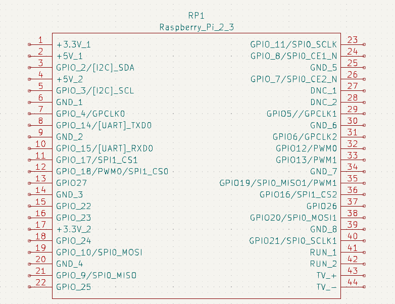
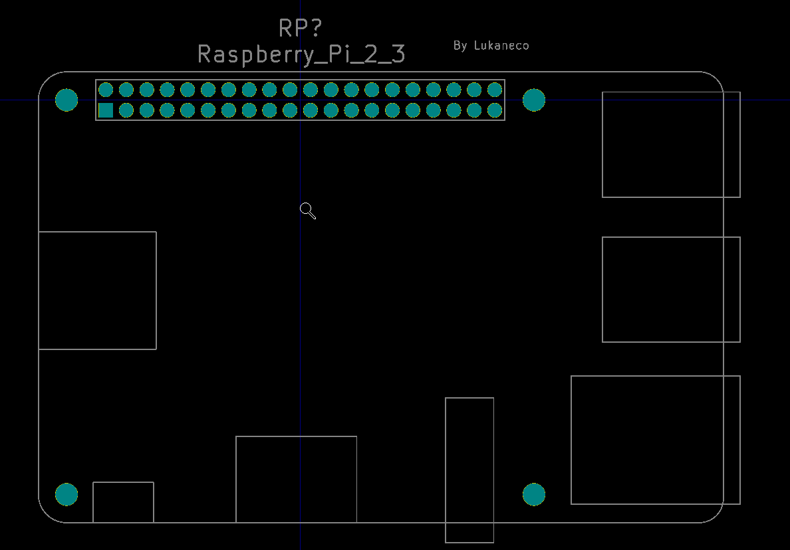

# KiCad Raspberry_Pi_2_or_3

This library is compatible with Pi 4.

## About

The library dimensions are taken from [Raspberry-Pi-1-2-3-Model-B.pdf](http://www.raspiworld.com/images/other/drawings/Raspberry-Pi-1-2-3-Model-B.pdf).

Based on the library of [Tinkerforge](https://github.com/Tinkerforge) with fixes from [Luca](https://github.com/sosie-js) as outlined [here](https://github.com/lucahttp/Raspberry-Pi-3-library-for-kicad/issues/1)
